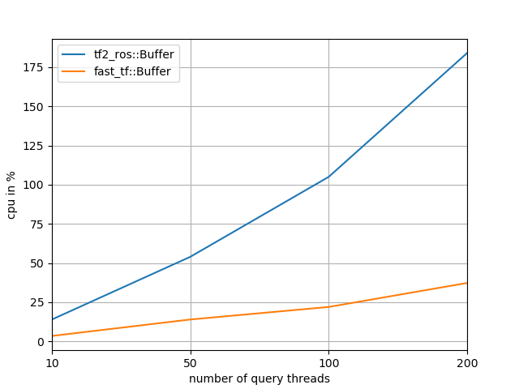

# FastTF

FastTF is a drop-in replacement for the [ros/geometry2](https://github.com/ros/geometry2).

## TL;DR

FastTF implements the interface of `tf2_ros::Buffer` without busy-waiting. This results in faster execution:

    

The chart above shows the CPU consumption for a Buffer/TransformListener pair with multiple threads querying the Buffer. The x-axis shows the number of querying threads (with the ticks 10, 50, 100 and 200). The y-axis shows the CPU usage.

The data was obtained using the perf/publisher.py, perf/listener_new and perf/listener_legacy nodes (these nodes aren't part of the installation). The results where obtained on Ubuntu 20.04, running on a AMD Ryzen 5 PRO 4650U with Radeon Graphics CPU. The compiler used is GCC 9.3.0.

## Features

The project is splitted in fast_tf and fast_tf_ros libraries. The first library depends only on Eigen - allowing it to be easier ported to ROS2, eventually. The second library mimics the interfaces of the tf2_ros library - aiming to ease potential switch.

Following features were added w.r.t. tf2_ros:
 - cycle detection at insertion time.
 - true shortest path computation: a query will evaluate only the nodes which connect the target and source frames.
 - no busy waiting: use condition_variables to wake up a query thread when (relevant) new data becomes available.

## Requirements

FastTF depends on Eigen and tf2 (tf2, tf2_ros, tf2_msgs and tf2_eigen). The compilation requires C++17.